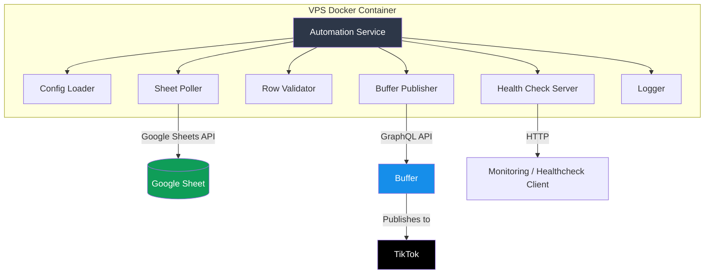
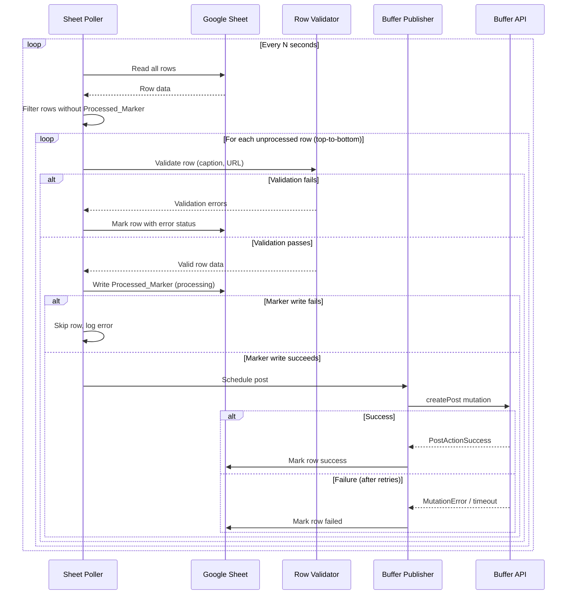

# Design Document: Sheet-to-TikTok Automation

## Overview

This system is a Node.js application deployed on a VPS that continuously monitors a Google Sheet for new rows and schedules TikTok video posts via Buffer's GraphQL API. It acts as a single-purpose automation bridge: Google Sheet → Validation → Buffer → TikTok.

The application runs as a long-lived process (containerized via Docker) that polls the sheet at a configurable interval, validates row data, sends scheduling requests to Buffer, and marks rows as processed. A health check endpoint provides operational visibility.

### Key Design Decisions

1. **Node.js with TypeScript** — Strong ecosystem support for both Google Sheets (`google-spreadsheet` package) and GraphQL clients; native async/await for clean polling loops.
2. **Polling over webhooks** — Google Sheets has limited push notification support; polling is simpler to deploy on a VPS and aligns with the requirements.
3. **Buffer GraphQL API** — Buffer's current API uses GraphQL mutations for post creation; the `createPost` mutation with `mode: addToQueue` and video assets handles the TikTok scheduling.
4. **Processed_Marker column in-sheet** — Using the sheet itself as the state store avoids needing a separate database. The marker column serves as the single source of truth for processing state, surviving restarts.
5. **Environment variables with config file fallback** — Standard 12-factor app pattern; env vars override config file values.

## Architecture



### Polling Loop Flow



## Components and Interfaces

### 1. ConfigLoader

Responsible for loading and validating all configuration at startup.

```typescript
interface AppConfig {
  googleSheetId: string;
  worksheetName: string;
  googleCredentialsPath: string;
  bufferAccessToken: string;
  bufferTikTokProfileId: string;
  pollingIntervalSeconds: number; // 10-300, default 60
  healthCheckPort: number;        // default 3000
}

interface ConfigLoader {
  load(): AppConfig; // throws ConfigError if invalid/missing
}
```

**Behavior:**
- Reads from environment variables first, then falls back to a JSON/YAML config file
- Validates all values (non-empty strings, numeric range for polling interval, file existence for credentials path)
- Exits with non-zero code and descriptive error if any required config is missing or malformed

### 2. SheetPoller

Handles all interaction with the Google Sheets API.

```typescript
interface SheetRow {
  rowNumber: number;
  captionText: string;
  videoUrl: string;
  processedMarker: string | null;
}

interface SheetPoller {
  authenticate(): Promise<void>;
  fetchUnprocessedRows(): Promise<SheetRow[]>;
  markRowProcessed(rowNumber: number, status: 'success' | 'error' | 'failed', detail?: string): Promise<void>;
}
```

**Behavior:**
- Authenticates using Google service account credentials via `google-auth-library`
- Uses `google-spreadsheet` package for sheet operations
- Reads all rows, filters to those with empty Processed_Marker column
- Returns rows in top-to-bottom order
- Writes status values to the Processed_Marker column

### 3. RowValidator

Validates extracted row data before publishing.

```typescript
interface ValidationError {
  field: 'captionText' | 'videoUrl';
  message: string;
}

interface ValidationResult {
  valid: boolean;
  errors: ValidationError[];
}

interface RowValidator {
  validate(row: SheetRow): ValidationResult;
}
```

**Validation Rules:**
- `captionText`: Must contain at least one non-whitespace character; max 4000 characters
- `videoUrl`: Must be non-empty; must start with `http://` or `https://` followed by a valid domain (contains at least one dot, no spaces)

### 4. BufferPublisher

Communicates with Buffer's GraphQL API to schedule posts.

```typescript
interface PublishResult {
  success: boolean;
  postId?: string;
  error?: string;
  attempts: number;
}

interface BufferPublisher {
  schedulePost(captionText: string, videoUrl: string): Promise<PublishResult>;
}
```

**Behavior:**
- Sends a `createPost` GraphQL mutation to `https://api.buffer.com`
- Uses Bearer token authentication
- Sets `channelId` to the configured TikTok profile ID
- Sets `mode: addToQueue` with `schedulingType: automatic` for immediate publishing
- Passes the video URL in the `assets` array as `[{ video: { url } }]`
- Enforces 30-second timeout per request
- Retries up to 3 times with 5-second delay on failure/timeout

### 5. HealthCheckServer

Exposes an HTTP endpoint for monitoring.

```typescript
interface HealthStatus {
  status: 'healthy' | 'degraded' | 'unhealthy';
  lastSuccessfulPoll: string | null; // ISO 8601
  uptime: number;
  consecutiveErrors: number;
}

interface HealthCheckServer {
  start(port: number): void;
  updateLastPoll(timestamp: Date): void;
  updateStatus(status: 'healthy' | 'degraded' | 'unhealthy'): void;
}
```

**Status logic:**
- `healthy`: Last poll succeeded, no consecutive errors
- `degraded`: 1-4 consecutive errors within 60 seconds
- `unhealthy`: 5+ consecutive errors within 60 seconds (polling ceased)

### 6. Logger

Structured logging with severity levels.

```typescript
type LogLevel = 'INFO' | 'WARN' | 'ERROR' | 'CRITICAL';

interface Logger {
  info(message: string, context?: Record<string, unknown>): void;
  warn(message: string, context?: Record<string, unknown>): void;
  error(message: string, context?: Record<string, unknown>): void;
  critical(message: string, context?: Record<string, unknown>): void;
}
```

**Behavior:**
- All log entries include ISO 8601 timestamp and severity level
- Outputs structured JSON to stdout (container-friendly)
- Context objects include row numbers, error details, attempt counts

### 7. AutomationService (Orchestrator)

The main application class that wires components together and runs the polling loop.

```typescript
interface AutomationService {
  start(): Promise<void>;
  stop(): Promise<void>;
}
```

**Behavior:**
- Loads config, authenticates with Google Sheets, starts health check server
- Runs polling loop with configurable interval
- Catches unhandled exceptions: logs, waits 5 seconds, restarts loop
- Tracks consecutive errors within 60-second window
- Ceases polling after 5 consecutive errors within 60 seconds
- Handles graceful shutdown on SIGTERM/SIGINT

## Data Models

### Google Sheet Structure

| Column A | Column B | Column C |
|----------|----------|----------|
| Caption Text | Video URL | Status |

- **Column A (Caption Text)**: The text caption for the TikTok post (max 4000 chars)
- **Column B (Video URL)**: Publicly accessible URL to the video file
- **Column C (Status / Processed_Marker)**: Processing state — empty (unprocessed), `success`, `error:<reason>`, `failed:<reason>`

### Configuration Schema

```typescript
// Environment variables (override config file)
SHEET_ID=string
WORKSHEET_NAME=string
GOOGLE_CREDENTIALS_PATH=string
BUFFER_ACCESS_TOKEN=string
BUFFER_TIKTOK_PROFILE_ID=string
POLLING_INTERVAL_SECONDS=number  // 10-300, default 60
HEALTH_CHECK_PORT=number         // default 3000

// Config file: config.json (fallback)
{
  "sheetId": "string",
  "worksheetName": "string",
  "googleCredentialsPath": "string",
  "bufferAccessToken": "string",
  "bufferTikTokProfileId": "string",
  "pollingIntervalSeconds": 60,
  "healthCheckPort": 3000
}
```

### Buffer GraphQL Mutation

```graphql
mutation CreatePost($text: String!, $channelId: String!, $videoUrl: String!) {
  createPost(
    input: {
      text: $text
      channelId: $channelId
      schedulingType: automatic
      mode: addToQueue
      assets: [{ video: { url: $videoUrl } }]
    }
  ) {
    ... on PostActionSuccess {
      post {
        id
        text
      }
    }
    ... on MutationError {
      message
    }
  }
}
```


## Correctness Properties

*A property is a characteristic or behavior that should hold true across all valid executions of a system—essentially, a formal statement about what the system should do. Properties serve as the bridge between human-readable specifications and machine-verifiable correctness guarantees.*

### Property 1: Unprocessed row filtering and ordering

*For any* Google Sheet state containing rows with various Processed_Marker values (empty, "success", "error:...", "failed:..."), the Sheet_Poller SHALL return only rows where the Processed_Marker column is empty, and those rows SHALL be returned in ascending row number order.

**Validates: Requirements 1.4, 6.1, 6.2, 6.3, 6.5**

### Property 2: Caption text validation

*For any* string value, the Row Validator SHALL accept it as a valid Caption_Text if and only if it contains at least one non-whitespace character AND its length does not exceed 4000 characters. All-whitespace strings and strings exceeding 4000 characters SHALL be rejected.

**Validates: Requirements 2.1**

### Property 3: Video URL validation

*For any* string value, the Row Validator SHALL accept it as a valid Video_URL if and only if it is non-empty AND begins with "http://" or "https://" followed by a valid domain name (containing at least one dot, no spaces). All other strings SHALL be rejected.

**Validates: Requirements 2.2**

### Property 4: Validation errors are fully reported

*For any* row containing one or more invalid fields, the Automation_Service SHALL collect all validation failures and report them in a single log entry, and SHALL continue processing subsequent rows without halting.

**Validates: Requirements 2.3, 2.5**

### Property 5: Configuration validation detects invalid values

*For any* configuration state where one or more required values are missing or malformed (non-numeric polling interval, polling interval outside 10-300 range, empty strings, inaccessible file paths), the ConfigLoader SHALL reject the configuration and produce an error message that names each invalid or missing key.

**Validates: Requirements 4.6, 4.7, 4.8**

### Property 6: Environment variable precedence

*For any* configuration key and any two distinct values A and B, if value A is set in the environment variable and value B is set in the config file, the ConfigLoader SHALL use value A.

**Validates: Requirements 4.9**

### Property 7: Log format invariant

*For any* log event emitted by the Automation_Service, the log entry SHALL contain a valid ISO 8601 timestamp and a severity level that is one of INFO, WARN, ERROR, or CRITICAL.

**Validates: Requirements 5.2**

## Error Handling

### Startup Errors

| Error | Behavior |
|-------|----------|
| Missing required config value | Exit with non-zero code, log which value is absent |
| Malformed config value | Exit with non-zero code, log which value is invalid and why |
| Google Sheets auth failure | Log error, exit with non-zero code |
| Credentials file not found | Exit with non-zero code, log file path |

### Runtime Errors — Sheet Poller

| Error | Behavior |
|-------|----------|
| Google Sheets API unreachable | Log error, skip cycle, retry next interval |
| Row data extraction fails | Log with row number, skip row |
| Processed_Marker write fails | Log with row number, skip row (will retry next cycle) |
| Post-Buffer marker write fails | Retry up to 3 times, then log for manual review |

### Runtime Errors — Buffer Publisher

| Error | Behavior |
|-------|----------|
| Buffer API error response | Retry up to 3 times (5s delay), then mark row as failed |
| Request timeout (30s) | Treat as failure, count toward retry limit |
| All retries exhausted | Log row number, attempt count, last error; mark row failed |

### Circuit Breaker

| Condition | Behavior |
|-----------|----------|
| Single unhandled exception | Log error, wait 5 seconds, restart polling loop |
| 5 consecutive exceptions in 60s | Log CRITICAL, cease polling, set health to "unhealthy" |
| Health check request after circuit break | Return "unhealthy" status (manual restart or external orchestrator needed) |

### Logging Availability

| Condition | Behavior |
|-----------|----------|
| Logging system unavailable during validation failure | Halt all processing until logging is restored |

## Testing Strategy

### Unit Tests (Example-Based)

Unit tests cover specific scenarios, error paths, and integration behavior:

- **Config loading**: Verify each config source (env var, file) is read correctly; verify exit on missing values
- **Auth failure handling**: Mock Google auth failure, verify exit code and log
- **Polling interval**: Verify polls occur at configured interval
- **Marker write failure**: Verify row is skipped when marker write fails
- **API unreachable**: Verify service continues after Google Sheets outage
- **Buffer success path**: Verify success marker written after Buffer confirms
- **Buffer retry logic**: Verify 3 retries with 5s delay, then failure marking
- **Circuit breaker**: Verify 5 exceptions in 60s triggers polling cessation
- **Health endpoint**: Verify JSON response format with status and timestamp

### Property-Based Tests

Property tests validate universal correctness properties with randomized inputs. Each test runs a minimum of 100 iterations.

**Library**: [fast-check](https://github.com/dubzzz/fast-check) (TypeScript property-based testing)

| Property | Test Description | Generator Strategy |
|----------|------------------|--------------------|
| Property 1 | Row filtering/ordering | Generate random sheet states (10-100 rows) with random marker values; verify filter output |
| Property 2 | Caption validation | Generate random strings (empty, whitespace, valid, oversized); verify accept/reject |
| Property 3 | URL validation | Generate random strings, valid URLs, malformed URLs; verify accept/reject |
| Property 4 | Error aggregation | Generate rows with 0-2 invalid fields; verify all errors collected and processing continues |
| Property 5 | Config validation | Generate random config objects with missing/malformed keys; verify error messages |
| Property 6 | Env var precedence | Generate random key-value pairs for both sources; verify env wins |
| Property 7 | Log format | Generate random log events; verify output format |

Each property test is tagged with:
```
// Feature: sheet-to-tiktok-automation, Property {N}: {property_text}
```

### Integration Tests

- **Google Sheets round-trip**: Authenticate, read rows, write markers (against test sheet)
- **Buffer API**: Send test post to Buffer sandbox/test profile
- **Docker deployment**: Build image, start container, verify health endpoint responds
- **End-to-end**: Add row to sheet, verify post appears in Buffer queue

### Test Configuration

```json
{
  "testRunner": "vitest",
  "propertyTestLibrary": "fast-check",
  "propertyTestIterations": 100,
  "timeout": 30000
}
```
